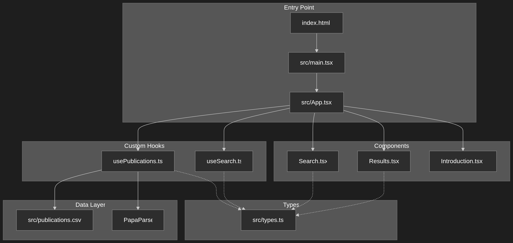
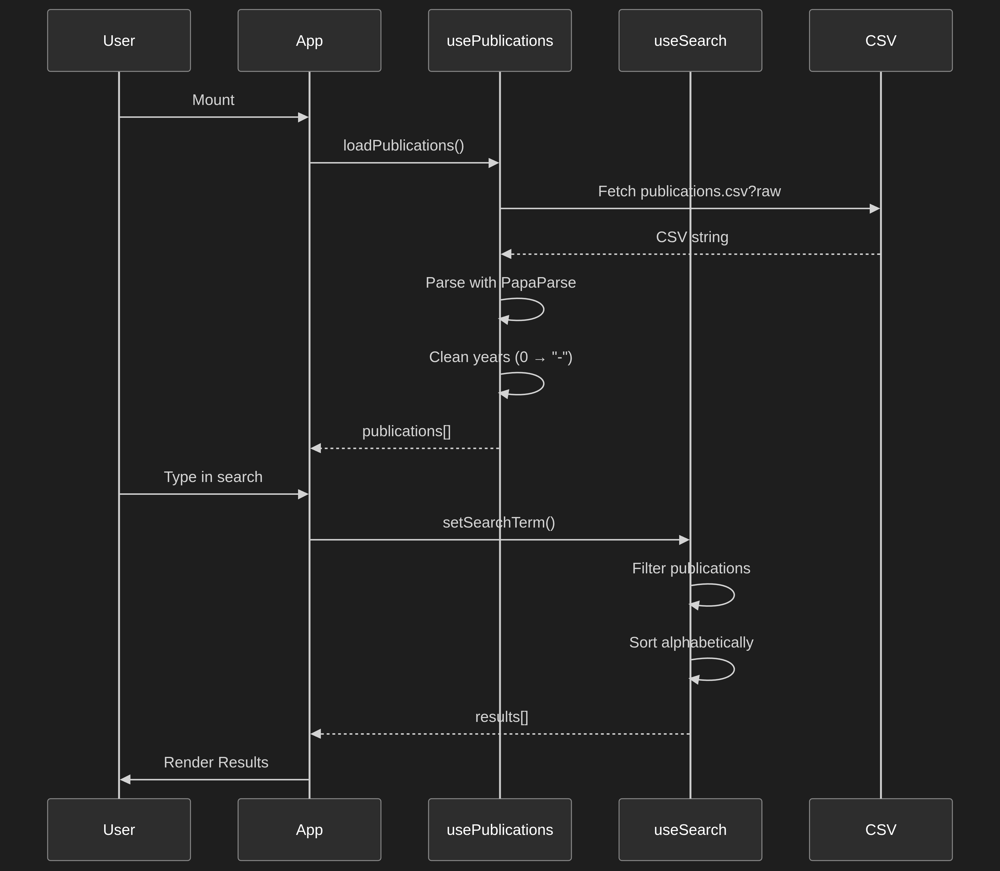

# UKFIT DB3 — Project Structure Overview

This is a **React 18 + TypeScript + Vite** single-page application for searching UK Falkland Islands scientific publications.

## Architecture Diagram



## File Structure

```
ukfitdb3/
├── index.html                    # HTML entry point with #root mount
├── package.json                  # Dependencies & scripts
├── tsconfig.json                 # TypeScript config (ES2020, strict mode)
├── vite.config.ts                # Vite config with React plugin + test setup
├── eslint.config.js              # ESLint flat config (React + TypeScript)
├── postcss.config.js             # PostCSS config
├── .prettierrc                   # Prettier formatting rules
│
├── src/
│   ├── main.tsx                  # React DOM render entry
│   ├── App.tsx                   # Root component (state management + routing)
│   ├── index.css                 # Tailwind CSS import + custom theme
│   ├── types.ts                  # Shared TypeScript types (Publication, Display)
│   ├── setupTests.ts             # Vitest/Jest testing setup
│   ├── vite-env.d.ts             # Vite type declarations
│   │
│   ├── usePublications.ts        # Hook: loads & parses CSV data
│   ├── useSearch.ts              # Hook: search logic with fuzzy matching
│   │
│   ├── components/
│   │   ├── Search.tsx            # Search input component
│   │   ├── Results.tsx           # Results list with sorting & animations
│   │   └── Introduction.tsx      # Welcome/about page
│   │
│   ├── assets/                   # Logo images
│   └── __mocks__/                # Mock images for tests
│
├── public/                       # Static assets
├── db/                           # Database-related files
├── plans/                        # Design documents & diagrams
└── .github/                      # CI/CD workflows
```

## Key Technologies

| Category | Technology |
|---|---|
| **Framework** | React 18 |
| **Language** | TypeScript 5.8 (strict mode) |
| **Build Tool** | Vite 5 |
| **Styling** | Tailwind CSS v4 (via PostCSS) |
| **Testing** | Vitest + jsdom + Testing Library |
| **Linting** | ESLint 9 (flat config) + Prettier |
| **CSV Parsing** | PapaParse |
| **Package Type** | ES Modules |

## Data Flow



## State Management Pattern

The app uses **custom React hooks** for state management:

- [`usePublications()`](src/usePublications.ts) — Manages the publications dataset (load, parse, clean)
- [`useSearch()`](src/useSearch.ts) — Manages search state (term, results, filtering logic)
- [`useState` + `useEffect` in `App.tsx`](src/App.tsx:16) — Manages view switching (HOME vs RESULTS)

## Search Logic

The [`useSearch()`](src/useSearch.ts:10) hook implements:
1. **Minimum length check** — 3 characters before searching
2. **Quoted phrase support** — `"exact phrase"` is treated as a single word
3. **Word tokenization** — Extracts individual words using `\w+` regex
4. **Word boundary matching** — Uses `\b` regex for whole-word matching
5. **Multi-field search** — Checks title, keywords, authors, and year
6. **Case-insensitive** — Uses `i` flag on regex
7. **Alphabetical sorting** — Results sorted by title using `localeCompare`

## Available Scripts

```bash
npm start        # Start dev server (Vite)
npm build        # Production build
npm test         # Run tests in watch mode
npm test:run     # Run tests once
npm lint         # ESLint check
npm format       # Prettier formatting
npm preview      # Preview production build
```
