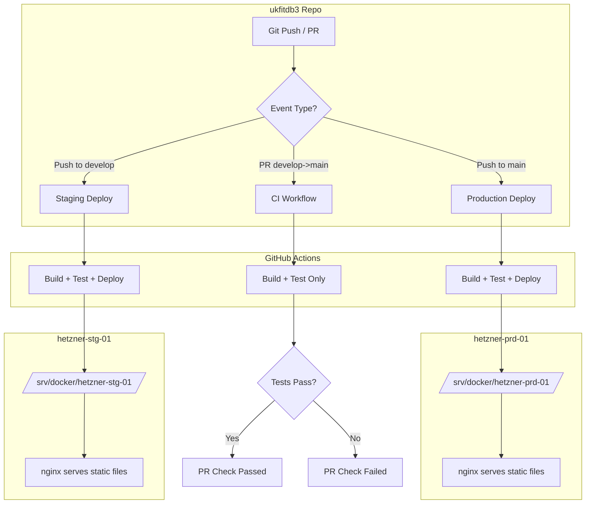
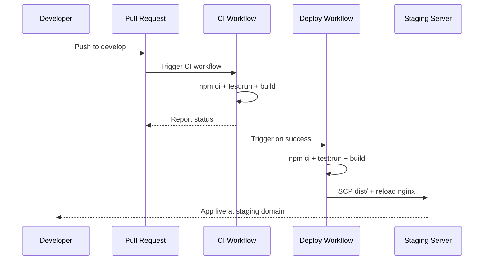
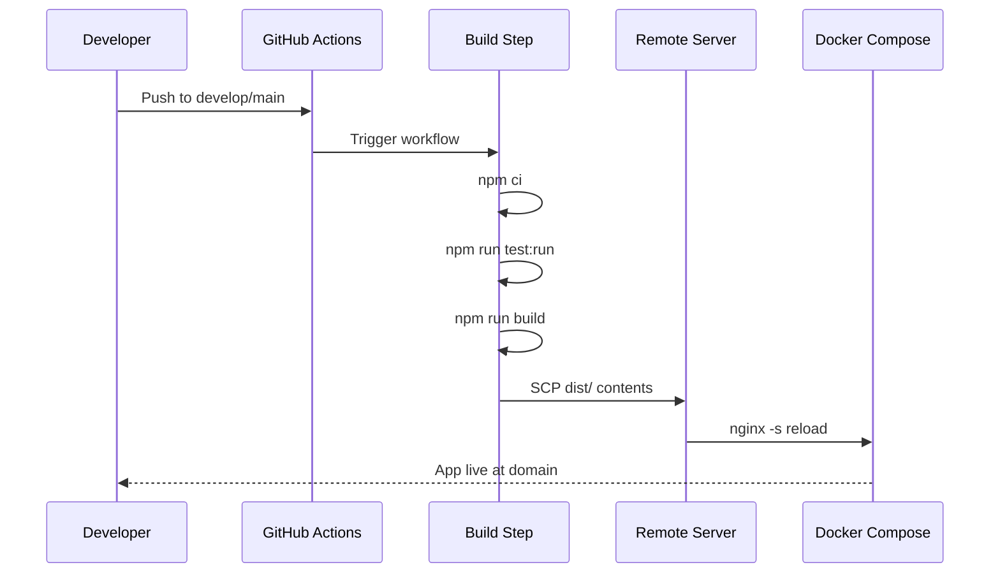

# GitHub Actions Deployment Plan for ukfitdb3

## Overview

This plan describes the GitHub Actions CI/CD pipeline for deploying the ukfitdb3 React/Vite application to two environments:

| Environment | Branch    | Domain                                   | Server         |
| ----------- | --------- | ---------------------------------------- | -------------- |
| Staging     | `develop` | `publications-staging.smartworldbox.com` | hetzner-stg-01 |
| Production  | `main`    | `publications.ukfit.org`                 | hetzner-prd-01 |

## Architecture



## Deployment Flow

1. **Developer pushes to `develop` branch**
   - GitHub Actions triggers the staging workflow
   - Vite app is built (`npm run build`)
   - `dist/` directory contents are SCP'd to hetzner-stg-01
   - nginx is reloaded to pick up changes

2. **Developer pushes to `main` branch**
   - GitHub Actions triggers the production workflow
   - Vite app is built (`npm run build`)
   - `dist/` directory contents are SCP'd to hetzner-prd-01
   - nginx is reloaded to pick up changes

## File Structure to Create

```
ukfitdb3/
├── .github/
│   └── workflows/
│       ├── ci.yml                # CI workflow (runs on PRs)
│       └── deploy.yml            # Deployment workflow (runs on push)
├── nginx/
│   ├── hetzner-stg-01/
│   │   └── sites/
│   │       └── publications-staging.smartworldbox.com-443.conf
│   └── hetzner-prd-01/
│       └── sites/
│           └── publications.ukfit.org-443.conf
└── plans/
    └── github-actions-deployment-plan.md
```

## GitHub Actions Workflow Design

Two workflows will be created in the **ukfitdb3** repository:

### 1. CI Workflow (`ci.yml`)

Runs on **pull requests** from `develop` to `main`. This workflow only builds and tests — it does not deploy.

**Trigger conditions:**

- Pull request targeting `main` branch

**Steps:**

- Checkout code
- Setup Node.js
- Install dependencies (`npm ci`)
- Run tests (`npm run test:run`)
- Build the app (`npm run build`) — validates the build works

### 2. Deployment Workflow (`deploy.yml`)

Runs on **pushes** to `main` branch and after **CI passes** on `develop` branch. Also supports **manual dispatch**.

**Trigger conditions:**

- Push to `main` branch → production deployment (direct, no CI gate needed)
- Successful CI workflow run on `develop` branch → staging deployment (CI-gated)
- Manual dispatch with environment selection

**Steps:**

- Checkout code
- Setup Node.js
- Install dependencies (`npm ci`)
- Run tests (`npm run test:run`)
- Build the app (`npm run build`)
- Setup SSH connection to target server
- Create target directory on server
- SCP the `dist/` contents to the server
- Reload nginx service via docker compose

**CI-Gated Staging Deployment Flow:**



## Nginx Configuration Templates

### Staging: `publications-staging.smartworldbox.com-443.conf`

```nginx
server {
    listen 443 ssl;
    listen [::]:443 ssl;

    resolver 127.0.0.11 valid=5s ipv6=off;

    server_name publications-staging.smartworldbox.com;

    ssl_certificate /etc/nginx/ssl/live/publications-staging.smartworldbox.com/fullchain.pem;
    ssl_certificate_key /etc/nginx/ssl/live/publications-staging.smartworldbox.com/privkey.pem;

    location / {
        root /usr/share/nginx/html;
        index index.html;
        try_files $uri $uri/ /index.html;
    }
}
```

### Production: `publications.ukfit.org-443.conf`

```nginx
server {
    listen 443 ssl;
    listen [::]:443 ssl;

    resolver 127.0.0.11 valid=5s ipv6=off;

    server_name publications.ukfit.org;

    ssl_certificate /etc/nginx/ssl/live/publications.ukfit.org/fullchain.pem;
    ssl_certificate_key /etc/nginx/ssl/live/publications.ukfit.org/privkey.pem;

    location / {
        root /usr/share/nginx/html;
        index index.html;
        try_files $uri $uri/ /index.html;
    }
}
```

## Required GitHub Secrets and Variables

### Secrets (per environment - set in GitHub repo Settings > Secrets and variables > Environments)

| Secret Name | Description                   |
| ----------- | ----------------------------- |
| `SSH_HOST`  | Server hostname or IP address |
| `SSH_PORT`  | SSH port (default: 22)        |
| `SSH_USER`  | SSH username                  |
| `SSH_KEY`   | SSH private key (PEM format)  |

### Variables

| Variable Name | Description                                                                 |
| ------------- | --------------------------------------------------------------------------- |
| `INFRA_DIR`   | Path to deployment directory on server (e.g., `/srv/docker/hetzner-prd-01`) |

## Environment Configuration

Two GitHub Environments should be created in the ukfitdb3 repository:

### `staging` Environment

- **Branch protection:** `develop`
- **Secrets:** SSH credentials for hetzner-stg-01
- **Variables:** `INFRA_DIR` pointing to the staging infrastructure directory

### `production` Environment

- **Branch protection:** `main`
- **Secrets:** SSH credentials for hetzner-prd-01
- **Variables:** `INFRA_DIR` pointing to the production infrastructure directory

## Deployment Workflow (YAML)

The deployment workflow has two separate jobs: one for production (triggered by push to `main`) and one for staging (triggered by successful CI run on `develop`).

```yaml
name: Deploy

on:
  push:
    branches:
      - main
  workflow_run:
    workflows: ['CI']
    types:
      - completed
  workflow_dispatch:
    inputs:
      environment:
        description: 'Deployment environment'
        required: true
        type: choice
        options:
          - staging
          - production

env:
  NODE_VERSION: '18'

jobs:
  # Production deployment - triggered by push to main
  deploy-production:
    name: Deploy to Production
    if: >-
      (github.event_name == 'push' && github.ref == 'refs/heads/main') ||
      (github.event_name == 'workflow_dispatch' && github.event.inputs.environment == 'production')
    runs-on: ubuntu-latest
    environment: production

    steps:
      - name: Checkout
        uses: actions/checkout@v4

      - name: Setup Node.js
        uses: actions/setup-node@v4
        with:
          node-version: ${{ env.NODE_VERSION }}
          cache: 'npm'

      - name: Install dependencies
        run: npm ci

      - name: Run tests
        run: npm run test:run

      - name: Build
        run: npm run build
        env:
          NODE_ENV: production

      - name: Setup SSH
        uses: ./.github/actions/setup-ssh # Or use swb-infra shared action
        with:
          host: ${{ secrets.SSH_HOST }}
          private-key: ${{ secrets.SSH_KEY }}
          username: ${{ secrets.SSH_USER }}
          port: ${{ secrets.SSH_PORT }}

      - name: Deploy to remote
        env:
          INFRA_DIR: ${{ vars.INFRA_DIR }}
        run: |
          # Create target directory for static files
          ssh server <<EOF
            mkdir -p $INFRA_DIR/nginx/html
          EOF

          # Copy built files to server
          scp -r dist/* server:$INFRA_DIR/nginx/html/

      - name: Reload nginx
        run: |
          ssh server <<EOF
            cd $INFRA_DIR
            docker compose exec nginx nginx -s reload
          EOF

  # Staging deployment - triggered by successful CI workflow run on develop
  deploy-staging:
    name: Deploy to Staging
    if: >-
      github.event.workflow_run.conclusion == 'success' ||
      (github.event_name == 'workflow_dispatch' && github.event.inputs.environment == 'staging')
    runs-on: ubuntu-latest
    environment: staging
    needs: deploy-production

    steps:
      - name: Checkout
        uses: actions/checkout@v4

      - name: Setup Node.js
        uses: actions/setup-node@v4
        with:
          node-version: ${{ env.NODE_VERSION }}
          cache: 'npm'

      - name: Install dependencies
        run: npm ci

      - name: Run tests
        run: npm run test:run

      - name: Build
        run: npm run build
        env:
          NODE_ENV: production

      - name: Setup SSH
        uses: ./.github/actions/setup-ssh # Or use swb-infra shared action
        with:
          host: ${{ secrets.SSH_HOST }}
          private-key: ${{ secrets.SSH_KEY }}
          username: ${{ secrets.SSH_USER }}
          port: ${{ secrets.SSH_PORT }}

      - name: Deploy to remote
        env:
          INFRA_DIR: ${{ vars.INFRA_DIR }}
        run: |
          # Create target directory for static files
          ssh server <<EOF
            mkdir -p $INFRA_DIR/nginx/html
          EOF

          # Copy built files to server
          scp -r dist/* server:$INFRA_DIR/nginx/html/

      - name: Reload nginx
        run: |
          ssh server <<EOF
            cd $INFRA_DIR
            docker compose exec nginx nginx -s reload
          EOF
```

### CI Workflow (`ci.yml`)

The CI workflow runs on **pull requests to `main`** (for PR checks) and on **pushes to `develop`** (to gate staging deployments).

```yaml
name: CI

on:
  pull_request:
    branches: [main]
  push:
    branches: [develop]

env:
  NODE_VERSION: '18'

jobs:
  ci:
    name: Build and Test
    runs-on: ubuntu-latest

    steps:
      - name: Checkout
        uses: actions/checkout@v4

      - name: Setup Node.js
        uses: actions/setup-node@v4
        with:
          node-version: ${{ env.NODE_VERSION }}
          cache: 'npm'

      - name: Install dependencies
        run: npm ci

      - name: Run tests
        run: npm run test:run

      - name: Build
        run: npm run build
        env:
          NODE_ENV: production
```

## Prerequisites

Before this deployment can work, the following must be set up:

### In swb-infra repo (on each server):

1. **Create nginx html directory** for serving static files:

   ```bash
   mkdir -p /srv/docker/hetzner-stg-01/nginx/html
   mkdir -p /srv/docker/hetzner-prd-01/nginx/html
   ```

2. **Add volume mount** to nginx service in docker-compose.yml:

   ```yaml
   volumes:
     - ./nginx/html:/usr/share/nginx/html:ro
   ```

3. **Add nginx site configs** to each environment's `nginx/sites/` directory:
   - `environments/hetzner-stg-01/nginx/sites/publications-staging.smartworldbox.com-443.conf`
   - `environments/hetzner-prd-01/nginx/sites/publications.ukfit.org-443.conf`

4. **Run Certbot** to obtain SSL certificates for both domains

### In ukfitdb3 repo (GitHub):

1. Create two GitHub Environments: `staging` and `production`
2. Add SSH secrets to each environment
3. Add `INFRA_DIR` variable to each environment

## Deployment Steps Summary



## Post-Deployment Checklist

- [ ] Verify SSL certificate is valid for the domain
- [ ] Confirm the app loads at the staging domain
- [ ] Run smoke tests on staging
- [ ] Verify the app loads at the production domain
- [ ] Update DNS if needed
